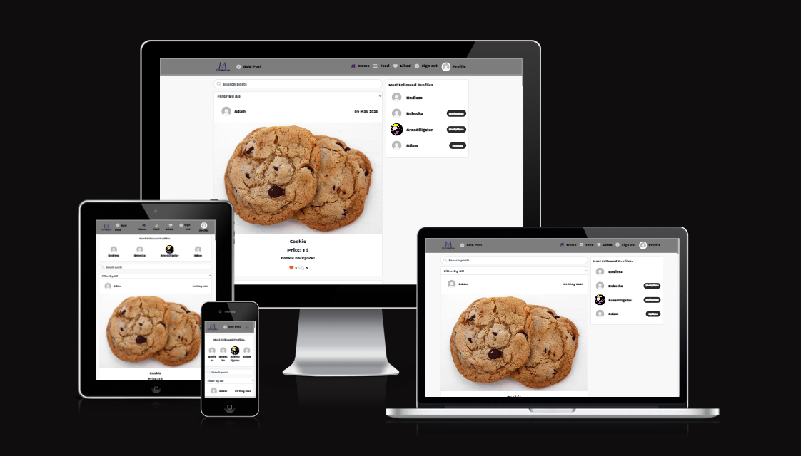

# Marketplace

Marketplace is a site for users to sell their old items.

Users can register an account and upload images of their old items that they want to sell, set a price and description. Other users can then comment on the item they want, and get in touch with the post owner. Users can also like items/posts that they are interested in, and follow profiles that they feel have interesting items for sale.

[Link to the live website](https://marketplace-proj.herokuapp.com/)

## Table of Contents

- [Overview](#overview)
- [Agile Methodology](#agile-methodology)
- [User Experience (UX)](#user-experience-ux)
  - [Strategy / Site Goals](#strategy--site-goals)
  - [Structure / Design Choices](#structure--design-choices)
- [Features](#features)
  - [Existing Features](#existing-features)
  - [Future Features](#future-features)
- [Technologies Used](#technologies-used)
- [Testing](#testing)
- [Bugs](#bugs)
- [Deployment](#deployment)
  - [Forking the GitHub Repository](#forking-the-github-repository)
  - [Creating a Local Clone](#creating-a-local-clone)
- [Credits](#credits)

[Back To Top](#marketplace)

___
## Overview

Marketplace is a responsive, mobile-first built website It is compatible with all current major browsers. The website is built for educational purposes, using Bootstrap and the rest_framework. It gives users the ability to create an account and create posts on the website, to sell used-items to other users. giving the owner of the post full CRUD functionality on their posts.

[Back To Top](#table-of-contents)

___
## Agile Methodology

Screenshots of project board, Epics and User Stories

[Back To Top](#table-of-contents)

___
## User Experience (UX)

### Strategy / Site Goals

Marketplace targets people interested in selling their old stuff, giving t hem the chance to reach out to a number of users to find someone who's interested in buying their items. The site aims to be fully responsive throughout and easily navigated creating posts.

The target audience are people who wants to sell their own old stuff. 
___
### Scope / User Stories

This section aims to determine what a user would expect from interacting with the website. Each User Story was recorded in [GitHub Issues](https://github.com/Undie92/marketplace/issues). 

**As a User**
* As a user I can view a navbar from every page so that i can navigate easily between pages. [#1](https://github.com/Undie92/marketplace/issues/1)
* As a user I can navigate through pages quickly so that I can view content seamlessly without page refresh. [#2](https://github.com/Undie92/marketplace/issues/2)
* As a user I can create a new account so that I can access all the features for signed up users. [#3](https://github.com/Undie92/marketplace/issues/3)
* As a user I can sign in to the app so that I can access functionality for logged in users. [#4](https://github.com/Undie92/marketplace/issues/4)
* As a user I can tell if i am logged in or not so that I can log in if i need to. [#5](https://github.com/Undie92/marketplace/issues/5)
* As a user I can maintain my logged-in status until i choose to log out so that my user experience is not compromised. [#6](https://github.com/Undie92/marketplace/issues/6)
* As a logged out user I can see sign in and sign up options so that I can sign in/sign up. [#7](https://github.com/Undie92/marketplace/issues/7)
* As a user I can view user's avatars so that I can easily identify users of the application. [#8](https://github.com/Undie92/marketplace/issues/8)
* As a logged in user I can create posts so that I can sell my no longer needed items. [#9](https://github.com/Undie92/marketplace/issues/9)
* As a user I can view the details of a single post so that I can learn more about it. [#10](https://github.com/Undie92/marketplace/issues/10)
* As a user I can like a post so that I can show my support for the posts that interests me. [#11](https://github.com/Undie92/marketplace/issues/11)
* As a user I can view all the most recent posts, ordered by most recently created first so that I am up to date with the marketplace. [#12](https://github.com/Undie92/marketplace/issues/12)
* As a user I can filter the posts so that find what i am searching for. [#13](https://github.com/Undie92/marketplace/issues/13)
* As a user I can search for posts with keywords so that I can find the posts and user profiles i am most interested in. [#14](https://github.com/Undie92/marketplace/issues/14)
* As a user I can view my liked posts so that I can easily find back to the product from the seller i was interested in. [#15](https://github.com/Undie92/marketplace/issues/15)
* As a logged in user I can view content filtered by users i follow so that i can keep up to date with what products they are selling. [#16](https://github.com/Undie92/marketplace/issues/16)
* As a user I can keep scrolling through the images on the site, that are loaded for me automatically so that i don't have to click on "next page". [#17](https://github.com/Undie92/marketplace/issues/17)
* As a user I can view the posts page so that I can read the comments and details about the posted product. [#18](https://github.com/Undie92/marketplace/issues/18)
* As a post owner I can edit my post title, description and price so that i can make corrections or update my post after it was created. [#19](https://github.com/Undie92/marketplace/issues/19)
* As a logged in user I can add comments to a post so that I can share my thoughts and questions about the product. [#20](https://github.com/Undie92/marketplace/issues/20)
* As a user I can see how long ago a comment was made so that i know how old a comment is. [#21](https://github.com/Undie92/marketplace/issues/21)
* As a user I can read comments on a post so that i know if someone else has bought this product or not. [#22](https://github.com/Undie92/marketplace/issues/22)
* As a owner of a comment I can delete my comment so that i can control removal of my comment from the application. [#23](https://github.com/Undie92/marketplace/issues/23)
* As a owner of a comment I can edit my comment so that i can fix or update my existing comment. [#24](https://github.com/Undie92/marketplace/issues/24)
* As a user I can view other users profiles so that i can see their posts and learn more about them. [#25](https://github.com/Undie92/marketplace/issues/25)
* As a user I can see a list of the most followed profiles so that i can see which profiles are popular. [#26](https://github.com/Undie92/marketplace/issues/26)
* As a user I can view statistics about a specific user: bio, number of posts, follows and users followed so that i can learn more about them. [#27](https://github.com/Undie92/marketplace/issues/27)
* As a logged in user I can follow and unfollow other users so that i can see and remove posts by specific users in my posts feed. [#28](https://github.com/Undie92/marketplace/issues/28)
* As a user I can view all the posts by a specific user so that i can catch up on their latests products or decide if i want to follow them. [#29](https://github.com/Undie92/marketplace/issues/29)
* As a logged in user I can edit my profile so that so that i can change my profile picture and bio. [#30](https://github.com/Undie92/marketplace/issues/30)
* As a logged in user I can update my username and password so that i can change my display name and keep my profile secure. [#31](https://github.com/Undie92/marketplace/issues/31)

___
### Structure / Design Choices

The website offers simplicity and consistency within its structure. Its structure was designed to be responsive on screens from 320px up to 2560px.

The NavBar displays the Marketplace logo and a hamburger button (on mobile) with links to the Add Post, Home, Feed, Liked, Sign out (if logged in), Sign in & Sign up (if logged out) and Profile (if logged in). 

The Home Page is acting like the landing page, with all users posts arriving directly when user enters the website, followed by a search bar to search for posts, and a filter option to filter from categories. Also shows "Most followed Profiles."

The Sign In is simple, and is asking for Username & Password, with a button to sign in. And under a button with text asking if you do not have an account, then you can sign up.

The Sign Up is simple, and is asking for Username, Password & to Confirm Password, with a button to sign up. And under a button with text asking if you already have an account, then you can sign in.

The Profile Page is only accessable by logged in users, and offers the user to edit profile, change username & change password, through 3 dots acting as a dropdown menu.
The Profile Page also shows how many posts the user has posted, how many followers the user has, and how many the user is following. Profile page also shows profile picture and the users posts. At the right side of the screen it shopws "Most followed profiles."

The Feed page gives the user the ability to see only posts from followed profiles.

The Liked page gives the user the ability to see posts that the user has liked, giving the user a chance to follow the products if they are interested in something.

 

 
The Database used for this project

 [Live website](https://backup-proj.herokuapp.com/)

 [Github Link](https://github.com/Undie92/backup-api)

 

[Back To Top](#table-of-contents)
___
## Features

### Existing Features

**Navigation & Content**

Featured on all pages, the fully responsive header includes:

* Marketplace clickable icon to redirect user to the frontpage
* Home clickable link to redirect user to the frontpage
* Feed clickable link to redirect user to Feed page, where user can see posts from followed profiles.
* Liked clickable link to redirect user to Liked page, where user can see only liked posts, to follow products that the user is interested in.
* If on mobile device, a hamburger button contains all the links above
* If logged in, Profile button which redirects user to the Profile Page.
* If logged in, Sign out button that logs the user out of the page and redirects the user to home page
* If logged in, Profile button that redirects user to their Profile page
* If not logged in, Sign in button that redirects user to login page
* If not logged in, Sign up button that redirects user to signup page

**Add Post**

* Gives the user the ability to create a post
* Provides required field to add picture
* Provides required field to add title
* Provides required field to add description
* Provides required field to add price
* Provides required field to choose category

**Home Page**

* Shows all Posts from all profiles
* Contains Search bar feature, to search products
* Contains category filter option, to filter through a set of categories

**Feed**

* Shows Only posts from followed profiles
* Contains Search bar feature, to search products
* Contains category filter option, to filter through a set of categories

**Liked**

* Shows only liked posts
* Contains Search bar feature, to search products
* Contains category filter option, to filter through a set of categories

**Sign Out**

* Signs the user out of the website

**Profile**

* Shows the profile of the logged in user
* Shows profile owner's profile picture
* Shows profile owner's Posts count
* Shows profile owner's Followed count
* Shows profile owner's Following count
* Shows profile owner's Username
* Shows profile owner's Description
* Shows profile owner's Posts
* Gives profile owner the ability to change password, username and edit their profile page

**IF LOGGED OUT**

* Shows sign in page to allow users to sign in
* Shows sign out page to allow users to sign out

Click to view screenshots of Navigation features

        Navigation collapsed on mobile  

        Navigation open on mobile

        Navigation open for logged user mobile

        Navigation on tablets

        Navigation on  desktops

Click to view screenshots of Home Page

Click to view screenshots of Feed Page

Click to view screenshots of Liked Page

Click to view screenshots of Profile Page

Click to view screenshots of Add Post Page

 

[Back To Top](#table-of-contents)
___
### Future Features

* Direct Message function to let users talk to users through DM instead of comments
* Auction style on posts
* Most recent Posts

[Back To Top](#table-of-contents)

___
## Technologies Used

* React
  * Main framework used to create the user interface
* Node
  * Package manager user to install dependencies
* Heroku
  * Used for application hosting
* ReactBootstrap
  * Used for styling
* Git
  * Version control software
* Github
  * Repository used to store base code and documents

## Packages

* "@testing-library/jest-dom@":"5.16.5"
* "@testing-library/react@":"11.2.7"
* "@testing-library/user-event@":"12.8.3"
* "axios@":"0.21.4"
* "bootstrap@":"4.6.2"
* "jwt-decode@":"3.1.2"
* "msw@":"0.35.0"
* "react-bootstrap@":"1.6.6"
* "react-dom@":"17.0.2"
* "react-infinite-scroll-component@":"6.1.0"
* "react-router-dom@":"5.3.4"
* "react-scripts@":"5.0.1"
* "react@":"17.0.2"
* "web-vitals@":"1.1.2"

## Tools

* Chrome DevTools and Lighthouse
  * Web Developer Tools

[Back To Top](#table-of-contents)

___
## Testing

### Google Dev Tools

For every page of the website, i used Lighthouse to check the rating all pages got.

Check screenshots for Lighthouse ratings on mobile

Looking at the performance rating, i can see that cloudinary is not compressing the images, so a compression program should have been used.

Check screenshots for Lighthouse ratings on desktop

___
## Manual Testing

 Nav Bar For All Pages 

TEST            | OUTCOME                          | PASS / FAIL  
--------------- | -------------------------------- | ---------------
Home page | When clicking on the home link on the nav bar, the browser redirects to the home page. | PASS
Feed page | When clicking on the feed link on the nav bar, the browser redirects to the feed page | PASS
Liked page | When clicking on the liked link on the nav bar, the browser redirects to the Liked page  | PASS
Add Post page | When clicking on the add post link on the nav bar, the browser redirects to the Add Post page  | PASS
Profile | When user is logged in, they will have access to the Profile link in the nav bar to be able to access their profile, when clicking on the profile link on the nav bar, the browser redirects to the Profile page | PASS
Sign in / Sign out Pages | When clicking on the sign in or sign out button the page redirects to the log in page or logs the user out | PASS
Sign up Page | When clicking on the sign up button it redirects to the sign up page, when submitting data, the user creates an account and gets redirected to the sign in page | PASS
Foreground and background | Checked foreground and background information is clearly legible | PASS
Text | Checked the text is clearly legible against the background | PASS

Home Page

TEST            | OUTCOME                          | PASS / FAIL  
--------------- | -------------------------------- | ---------------
Responsiveness | Checked elements for consistant scaleability | PASS
Accessibility | Checked the accessibility of the page using lighthouse | PASS
Search Bar | Checked the function of the search bar, querying and finding the correct items i'm searching for | PASS
Filter Option | Checked the function of the filter option, filtering through all categories | PASS 

Feed Page

TEST            | OUTCOME                          | PASS / FAIL  
--------------- | -------------------------------- | ---------------
Responsiveness | Checked elements for consistant scaleability | PASS
Accessibility | Checked the accessibility of the page using lighthouse | PASS
Search Bar | Checked the function of the search bar, querying and finding the correct items i'm searching for | PASS
Filter Option | Checked the function of the filter option, filtering through all categories | PASS 

Liked Page

TEST            | OUTCOME                          | PASS / FAIL  
--------------- | -------------------------------- | ---------------
Responsiveness | Checked elements for consistant scaleability | PASS
Accessibility | Checked the accessibility of the page using lighthouse | PASS
Search Bar | Checked the function of the search bar, querying and finding the correct items i'm searching for | PASS
Filter Option | Checked the function of the filter option, filtering through all categories | PASS 

Profile Page

TEST            | OUTCOME                          | PASS / FAIL  
--------------- | -------------------------------- | ---------------
Responsiveness | Checked elements for consistant scaleability | PASS
Accessibility | Checked the accessibility of the page using lighthouse | PASS
Profile Picture | Submitted profile picture is correctly showing | PASS
Post, Followers, Following counters | Updating correctly according to user events | PASS
Edit Profile | Editing profile and submitting new data works | PASS
Change Username | Changing username, displaying the correct updated username | PASS
Change Password | Changing password, updating password in database correctly | PASS

Add Post Page

TEST            | OUTCOME                          | PASS / FAIL  
--------------- | -------------------------------- | ---------------
Responsiveness | Checked elements for consistant scaleability | PASS
Accessibility | Checked the accessibility of the page using lighthouse | PASS
Add Image | Adding a picture, showing the correct picture | PASS
Create button | When submitted all required fields, creating the post | PASS
Cancel button | When pressing cancel button, takes me back to previous visited page | PASS
Choosing category | All categories puts the post in the correct category | FAIL (Food doesn't work, throws error, rest is okay)

[Back To Top](#table-of-contents)

___
### Bugs

Creating post with category of food

When trying to create a post with category of food, you recieve "POST 

[https://backup-proj.herokuapp.com/posts/](https://backup-proj.herokuapp.com/posts/) 
400 (Bad Request)" And i have no idéa on why, and had no time to figure it out, due to time restraint of assignment. The category "Food" filter on Home page works.

[Back To Top](#table-of-contents)

___
## Deployment

For good practice, this project was deployed early to [Heroku](https://www.heroku.com) in order to save time and avoid nasty surprises later on.

Steps taken before deploying the project to Heroku

### Create the Heroku App

1. Login to Heroku and click on the top right button ‘New’ on the dashboard. 
2. Click ‘Create new app’.
3. Give your app a unique name and select the region closest to you. 
4. Click on the ‘Create app’ button.

First Deployment

1. Go back to the Heroku dashboard and click on the ‘Deploy’ tab.  

2. For deployment method, select ‘GitHub’ and search for the project’s repository from the list. 

3. Select and then click on ‘Deploy Branch’.  

4. When the build log is complete it should say that the app has been successfully deployed.

5. Click on the ‘Open App’ button to view it and the React icon will show up.

Final Deployment

1. Go back to the Heroku dashboard and click on the ‘Deploy’ tab.  

2. For deployment method, select ‘GitHub’ and search for the project’s repository from the list. 

3. Select and then click on ‘Deploy Branch’.  

4. When the build log is complete it should say that the app has been successfully deployed.

5. Click on the ‘Open App’ button to view the complete website, test it out so that it functions correctly.

___
### Forking the GitHub Repository

Steps to Fork the GitHub Repository

Forking allows you to view and edit the code without affecting the original repository

1. Locate the GitHub repository. Link to this repository can be found [here](https://github.com/Undie92/marketplace).
2. Click on 'Fork', in the top right-hand corner.
3. This will take you to your own repository to a fork with the same name as the original branch.

___

### Creating a Local Clone

Steps to Creating a Local Clone

1. Go to the GitHub repository. Link to this repository can be found [here](https://github.com/Undie92/marketplace).
2. Click on 'Code' to the right of the screen. This will open a dropdown. Click on HTTPs and copy the link.
3. Open Git Bash in your IDE and change the current working directory to the location where you want the cloned directory.
4. Type `git clone`, paste the URL you copied earlier, and press Enter to create your local clone.

More information on Creating and Managing repositories can be found [here](https://docs.github.com/en/repositories/creating-and-managing-repositories/cloning-a-repository)
 

[Back To Top](#table-of-contents)

___

## Credits

Pages I Referred to a lot:

* [Django Rest-Framework](https://www.django-rest-framework.org/)
* [React Bootstrap Documentation](https://react-bootstrap.github.io/getting-started/introduction)
* Code Institute LMS

[Back To Top](#table-of-contents)

___

